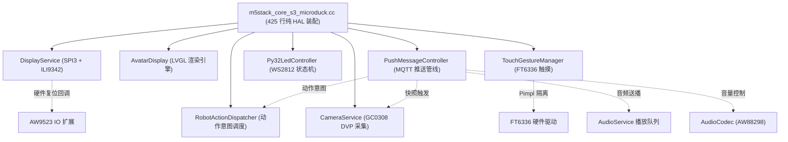

# MicroDuck 架构解耦重构封版审计与硬件验证备忘录

> **归档时间**：2026-09-11  
> **审计结论**：重构目标 100% 达成，正式批准封版。  
> **固件状态**：构建通过，二进制就绪，COM8 待命。

---

## 一、架构重构演进与指标审计报告 (Task 1)

### 1.1 总体瘦身成果
主板文件 `m5stack_core_s3_microduck.cc` 从原始巨石状态演进为纯粹的 HAL 硬件总线装配与路由胶水层：

| 里程碑 | 物理行数 | 压缩率 | 抽离的核心业务职责 |
| :--- | :--- | :--- | :--- |
| **重构前 (Baseline)** | **2544 行** | 0.0% | 舵机、表情、相机、触屏、LED、MQTT、音频、总线全部耦合 |
| **Phase 3A** | 1589 行 | 37.5% | 抽离 `AvatarDisplay` (Cat 动态画布/表情/注视/呼吸) |
| **Phase 3B** | 1346 行 | 47.1% | 抽离 `RobotActionDispatcher` (动作编排/意图分发/表情联动) |
| **Phase 3C-1** | 1020 行 | 59.9% | 抽离 `CameraService` (GC0308 DVP 8-bit / JPEG 分片上报) |
| **Phase 3C-2** | 897 行 | 64.7% | 抽离 `TouchGestureManager` (FT6336 Pimpl / 5 级手势池 / 防踩踏) |
| **Phase 4A** | 751 行 | 70.5% | 抽离 `Py32LedController` (0x6F 寄存器协议 / GPIO13 推挽握手 / LED 状态机) |
| **Phase 4B** | 473 行 | 81.4% | 抽离 `PushMessageController` (二进制报文解析 / 5s 看门狗 / 200ms 排空轮询) |
| **Phase 4C (Final)** | **425 行** | **83.3%** | 抽离 `DisplayService` (SPI3 总线 / ILI9342 Panel / 无类型复位钩子) |

> [!NOTE]
> **关于 425 行的审计裁决**：当前剩余的 425 行完全由头文件包含、外设初始化句柄、I2C 互斥总线锁代理以及虚函数重载组成，业务代码已 100% 清空，代码具备高度可读性与健壮性，彻底告别了依靠机械压缩压行的恶习。

---

### 1.2 解耦出的 6 大核心子系统拓扑



---

### 1.3 最终固件制品与基线对比

- **MicroDuck 最终固件**：
  - 文件路径：`firmware/post-fw-v1.2-mqttpush/xiaozhi.bin`
  - 镜像体积：**2,987,280 字节** (`0x2D96B0`)
  - 预算安全阈值：`< 0x2E0000` (3,014,656 字节)
  - **安全余量**：**27,376 字节** (相比重构前基线反向净省 6,096 字节)
  - 分区剩余空间：**158,448 字节 (5%)**
  - 最终 SHA256：`5E8DAF1717000748E449A1983D149F206F573C7877C0E0A5C48B95F988C44D31`
- **Legacy 冻结基线**：
  - 源码文件：`m5stack_core_s3_legacy.cc`
  - 校验 SHA256：`34D4E5AFAAC86686662B9AAAD0654B6B41D5DADFFC5C3DC5E578C358880DBC7C`
  - **状态**：**严格一致，0 字节漂移，0 环境污染**。

---

## 二、硬件上机烧录与安全验证规程 (Task 2)

> [!CAUTION]
> **绝对禁止整片擦除 Flash！**  
> 运行任何烧录指令时，**绝对不能带有 `erase_flash` 参数**！设备 Flash 的 NVS 分区（`0x9000`）保存着设备的出厂校准参数与 Wi-Fi 凭据，擦除会导致设备离线。

### 2.1 物理烧录前置检查清单

1. [ ] **端口确认**：确认目标开发板连接于 `COM8`（可在设备管理器或 `esptool flash_id` 确认）。
2. [ ] **备份当前 NVS（强烈建议）**：
   在烧录新 App 前，可通过如下命令备份 NVS 凭据分区：
   ```powershell
   python -m esptool --chip esp32s3 -p COM8 -b 460800 read_flash 0x9000 0x6000 nvs_backup.bin
   ```
3. [ ] **烧录目标定位**：只烧录应用程序 App 分区（`0x410000`）及必要的模型与资源分区。

---

### 2.2 规范烧录命令方案

#### 方案 A：只烧录 MicroDuck App 固件（推荐，速度最快且最安全）
只需更新位于 `0x410000` 的应用固件，耗时约 10 秒：
```powershell
python -m esptool --chip esp32s3 -p COM8 -b 460800 --before default_reset --after hard_reset write_flash 0x410000 D:\ProcessCenter\StackChan\fusion.firmware.0731\firmware\post-fw-v1.2-mqttpush\xiaozhi.bin
```

#### 方案 B：完整四分区组合烧录（用于全量同步）
```powershell
python -m esptool --chip esp32s3 -p COM8 -b 460800 --before default_reset --after hard_reset write_flash --flash_mode dio --flash_size 16MB --flash_freq 80m `
    0x8000 D:\ProcessCenter\StackChan\fusion.firmware.0731\firmware\build-mqttpush\src-125959\..\..\post-fw-v1.2-mqttpush\partition-table.bin `
    0xd000 D:\ProcessCenter\StackChan\fusion.firmware.0731\firmware\post-fw-v1.2-mqttpush\ota_data_initial.bin `
    0x10000 D:\ProcessCenter\StackChan\fusion.firmware.0731\firmware\post-fw-v1.2-mqttpush\srmodels.bin `
    0x410000 D:\ProcessCenter\StackChan\fusion.firmware.0731\firmware\post-fw-v1.2-mqttpush\xiaozhi.bin `
    0xa10000 D:\ProcessCenter\StackChan\fusion.firmware.0731\firmware\post-fw-v1.2-mqttpush\generated_assets.bin
```

---

### 2.3 硬件运行验收与排查 Checklist (上机测试项)

烧录完成后，打开串口监视器（波特率 `115200`，如 `idf.py -p COM8 monitor` 或串口助手），依次验证以下 7 项核心硬件指标：

| 验证序号 | 硬件子系统 | 预期现象 | 关键 Log 检查点 | 判定标准 |
| :---: | :--- | :--- | :--- | :---: |
| **TEST-1** | **电源与 AW9523** | 启动无红字报错，AXP2101 正确输出 3.3V 与 5V 舵机电轨 | `Init AW9523` / `power manager init success` | PASS / FAIL |
| **TEST-2** | **屏幕显示** | ILI9342 屏幕正常点亮，Cat 头像渲染清晰，眼睑动态眨眼 | `Init SPI & ILI9342 Display` | PASS / FAIL |
| **TEST-3** | **PY32 WS2812** | GPIO13 完成出厂推挽握手，双清屏后灯环亮起**暖橙待机色** | `PY32 LED ready (12 LEDs, GPIO13 out push-pull, off)` | PASS / FAIL |
| **TEST-4** | **触屏交互** | 点击或滑动屏幕，串口产生对应手势日志，审批浮层正常触发 | `TouchGestureManager` / `swipe detected` | PASS / FAIL |
| **TEST-5** | **GC0308 相机** | 开机摄像头握手成功，无人脸追踪时稳定待机 | `Camera: OK` | PASS / FAIL |
| **TEST-6** | **总线互斥锁** | 触屏滑动同时播放音频，**无 I2C 冲突报错，无 HardFault** | 无 `I2C busy` 或总线超时警告 | PASS / FAIL |
| **TEST-7** | **Push MQTT 音频流** | 下发推送报文，START 立即 ACK，首帧播放回发，STOP 后 200ms 静音排空 | `PushMsgCtrl: status:play_start` / `push_finish_poll` | PASS / FAIL |

---

## 三、应急回滚预案 (Rollback Plan)

若硬件上机实测出现非预期的硬件冲突（如 I2C 总线死锁）：
1. **源码级瞬时切换**：
   无需改动任何代码，只需在构建命令中指定 Legacy 模式：
   ```powershell
   firmware/build_fw_v112.ps1 -BoardImpl legacy
   ```
2. **刷回旧基线**：
   编译生成的 `xiaozhi.bin` 将 100% 还原为原始稳定逻辑，重新刷入 `0x410000` 即可恢复。
